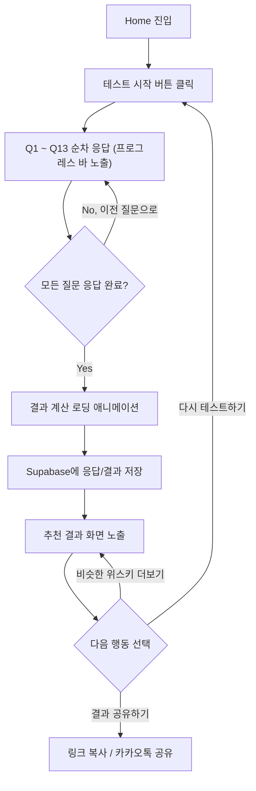
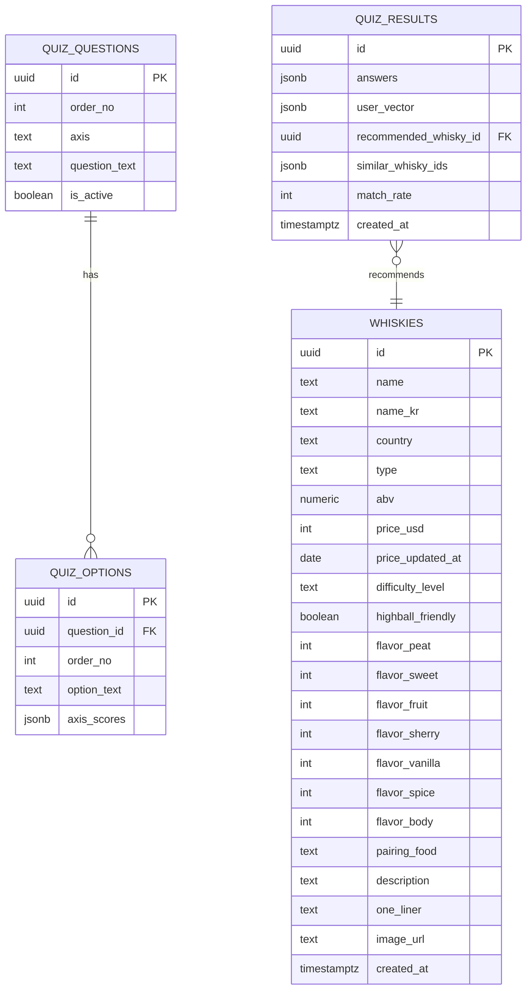

# PRD: 내 입맛에 맞는 위스키 (Whisky Flavor Match)

| 항목 | 내용 |
| --- | --- |
| 문서 버전 | v1.0 |
| 작성일 | 2026-07-07 |
| 작성자 | PM |
| 상태 | 개발 착수용 확정안 |
| 관련 스택 | Next.js 15 (App Router) / React 19 / Tailwind CSS / Supabase / Framer Motion |

---

## 1. 서비스 개요

### 1-1. 서비스명
**내 취향 한 잔, 위스키 편 (Whisky Flavor Match)**

### 1-2. 한 줄 소개
몇 가지 취향 질문에 답하면, 실제 위스키 향미 데이터를 기반으로 나에게 맞는 위스키를 추천해주는 웹 서비스.

### 1-3. 서비스 목표
- 위스키 지식이 전혀 없는 입문자도 **평균 3분 이내**에 자신의 취향에 맞는 위스키를 찾을 수 있도록 한다.
- "재미로 보는 성격 테스트"가 아니라 **실제 위스키 테이스팅 노트(피트/스모키, 셰리, 과일향, 바닐라, 스파이스, 바디감, 도수)에 기반한 논리적 매칭**을 제공한다.
- 결과에 추천 이유, 향미 프로파일, 안주, 비슷한 위스키까지 제공해 사용자가 스스로 "왜 이 위스키인지"를 이해하게 한다.

### 1-4. 타겟 사용자
- 20~40대, 위스키 입문자("위린이")
- 하이볼을 즐기다가 위스키 자체에 관심이 생긴 사용자
- 바/편의점/마트에서 위스키를 고를 때 무엇을 골라야 할지 모르는 사용자
- 위스키 용어(피트, 캐스크, 숙성연수 등)에 익숙하지 않은 사용자

### 1-5. 핵심 가치
| 가치 | 설명 |
| --- | --- |
| 쉬움 | 전문 용어 없이 일상적인 취향(디저트, 커피, 캠핑 등)으로 질문 |
| 신뢰성 | 실제 위스키 향미 데이터 기반의 벡터 매칭 알고리즘 (감성적 재미 요소 아님) |
| 즉시성 | 회원가입/로그인 없이 즉시 테스트 → 즉시 결과 |
| 실용성 | 추천 이유, 안주, 가격대, 입문 난이도까지 실행 가능한 정보 제공 |

---

## 2. 사용자 플로우 (User Flow)



**단계별 설명**

1. **Home**: 서비스 소개 + "테스트 시작" CTA
2. **테스트 시작**: Quiz 화면으로 라우팅, 1번 질문부터 시작
3. **질문 응답 (13문항)**: 한 화면에 1문항씩, 선택 즉시 다음 질문으로 자동 전환
4. **결과 계산**: 클라이언트에서 점수 합산 → 서버(API)에서 매칭 알고리즘 실행
5. **결과 저장**: 익명 세션으로 Supabase `quiz_results` 테이블에 기록 (통계/카운터용)
6. **추천 결과**: 1위 위스키 상세 정보 + 비슷한 위스키 2종 노출
7. **다시 테스트 / 공유**: 재시작 또는 결과 링크 공유로 종료

---

## 3. IA (Information Architecture)

```
내 입맛에 맞는 위스키
│
├── Home (/)
│   ├── 서비스 소개 섹션
│   ├── [테스트 시작하기] 버튼 (Primary, 앰버색)
│   └── [위스키 모아보기] 버튼 (Secondary, 하늘색 계열)
│
├── Catalog "위스키 모아보기" (별도 라우트 없음, Home과 같은 `/` 위에서 상태 전환)
│   ├── 카테고리 필터 칩(전체/싱글몰트/블렌디드/블렌디드몰트/버번/피트·스모키/쉐리/프루티/하이볼 추천)
│   ├── 필터링된 위스키 카드 그리드 (카드 클릭 시 Whisky Detail로 이동)
│   └── [홈으로] 버튼
│
├── Whisky Detail (별도 라우트 없음, `?w=<whiskyId>` 쿼리로 개별 링크 지원)
│   ├── 위스키 이름/타입 배지 (매치율 배지 없음)
│   ├── 위스키 소개 (해당 위스키의 고정 설명, "추천 이유" 문구 없음)
│   ├── 향미 프로파일 (해당 위스키 자체의 레이더 차트)
│   ├── 상세 정보 (도수/국가/가격대/입문난이도)
│   ├── 추천 안주
│   ├── 향미가 비슷한 다른 위스키 2종 (사용자 취향과 무관, 위스키 간 거리 기준)
│   └── [목록으로 돌아가기] / [위스키 링크 복사하기] 버튼
│
├── Quiz (별도 라우트 없음, Home과 같은 `/` 위에서 상태 전환)
│   ├── 진행 상태 바 (n/13)
│   ├── 질문 텍스트
│   ├── 선택지 (4~5개)
│   └── [이전 질문] 이동 (선택적 UI)
│
├── Loading (Quiz → Result 전환 시 오버레이, 별도 라우트 없음)
│
├── Result (별도 라우트 없음, Home과 같은 `/` 위에서 상태 전환으로 렌더링)
│   ├── 추천 위스키 카드 (이미지, 이름, 매치율)
│   ├── 추천 이유
│   ├── 향미 프로파일 (레이더 차트)
│   ├── 상세 정보 (도수/국가/가격대/입문난이도)
│   ├── 추천 안주
│   ├── 비슷한 위스키 리스트 (2종)
│   ├── 한 줄 추천 문구
│   └── [다시 테스트하기] / [결과 공유하기] 버튼
│
└── (공용) NotFound / Error 화면
```

> **실제 구현**: `/quiz`, `/result/[resultId]` 같은 별도 라우트나 REST API 서버는 두지 않고, 단일 페이지(`/`)에서 `stage` 상태(`home`/`quiz`/`loading`/`result`)로 화면을 전환하는 SPA 구조로 만들었다. 결과 공유는 서버/DB 조회 없이 **URL 자체에 답변을 인코딩**해서 완결한다: `?a=<base64(선택지 id 배열)>`. 추천 알고리즘(`getRecommendation`)이 answers만으로 결과를 그대로 재현하는 순수 함수이기 때문에, 이 링크를 열면 그 순간 클라이언트에서 동일한 결과를 다시 계산해서 보여준다. Supabase에는 통계 집계용으로 결과를 별도 저장하지만, 공유 링크가 여기에 의존하지는 않는다 (DB 저장 지연·실패와 무관하게 링크가 항상 유효해야 하기 때문 — 실제로 DB 저장 완료를 기다리다 공유 링크가 깨지는 버그가 있었다).

---

## 4. 화면별 기능 명세

### 4-1. Home (`/`)

**목적**: 서비스를 소개하고 테스트 시작을 유도한다.

| 구분 | 내용 |
| --- | --- |
| UI 구성요소 | 헤더(서비스명/로고), 히어로 카피, 서비스 설명 3~4줄, 대표 이미지, 향미 축 아이콘(피트/스위트/프루티 등) 소개, CTA 버튼 2개, 푸터 |
| 버튼 | `[내 위스키 찾으러 가기 →]` (Primary CTA, 앰버색) / `[위스키 모아보기]` (Secondary, 하늘색 계열로 시각적 구분) |
| 입력값 | 없음 |
| 동작 | 1. Primary CTA 클릭 시 `stage`를 `quiz`로 전환(별도 라우팅 없음), 로컬 상태에 새 퀴즈 세션 시작<br>2. Secondary 버튼 클릭 시 `stage`를 `catalog`로 전환 |
| 예외 처리 | 없음 (서버 호출이 없는 화면) |

### 4-1-1. 위스키 모아보기 (Catalog, 별도 라우트 없음)

**목적**: 테스트 없이도 40종 위스키 전체를 카테고리별로 훑어볼 수 있게 한다.

| 구분 | 내용 |
| --- | --- |
| UI 구성요소 | 상단 `[홈으로]` 버튼 + 타이틀("위스키 모아보기"), 카테고리 필터 칩(가로 스크롤), 선택된 카테고리의 위스키 수, 위스키 카드 그리드(국문/영문명, 타입 배지, 한 줄 추천, 국가·도수·난이도·가격) |
| 버튼 | 카테고리 필터 칩(전체/싱글몰트/블렌디드/블렌디드몰트/버번/피트·스모키/쉐리/프루티/하이볼 추천), `[홈으로]`, 위스키 카드(클릭 가능) |
| 입력값 | 카테고리 선택(단일 선택) |
| 동작 | 1. 기본값은 "전체"(40종) 표시<br>2. 카테고리 칩 클릭 시 `lib/whiskyCategories.ts`에 정의된 조건(`type` 필드 또는 `flavor` 축 임계값, `highballFriendly`)으로 즉시 필터링<br>3. 위스키 카드 클릭 시 `stage`를 `whiskyDetail`로 전환하고 URL에 `?w=<whiskyId>` 반영(4-1-2 참고)<br>4. `[홈으로]` 클릭 시 `stage`를 `home`으로 전환 |
| 예외 처리 | 없음 (정적 데이터 필터링만 수행, 서버 호출 없음) |

### 4-1-2. 위스키 상세 (Whisky Detail, 별도 라우트 없음)

**목적**: 테스트를 거치지 않고도 특정 위스키의 향미 프로파일과 소개를 확인할 수 있게 한다. Result 화면과 레이아웃은 거의 동일하지만, **사용자 취향 매칭 관련 요소(매치율 배지, "추천 이유" 문구)는 없다** — 위스키 자체의 정보만 보여준다는 점이 핵심 차이다.

| 구분 | 내용 |
| --- | --- |
| UI 구성요소 | 타입 배지(매치율 배지 대체), 위스키 이름/설명, 향미 프로파일 레이더 차트(해당 위스키 자체 벡터), 상세 정보 표(도수/국가/가격대/입문난이도), 추천 안주, "비슷한 위스키"(향미 유사도 기준 2종) |
| 버튼 | `[목록으로 돌아가기]`, `[위스키 링크 복사하기]` |
| 입력값 | 없음 (`?w=<whiskyId>` 쿼리로 진입 시 해당 위스키 조회) |
| 동작 | 1. `getWhiskyById(whiskyId)`로 위스키 데이터 조회 후 렌더링(서버 호출 없음)<br>2. "비슷한 위스키"는 `getSimilarWhiskies(whisky, 2)`로 계산 — 사용자 답변이 아니라 **위스키 벡터끼리의 가중 거리**로 가장 가까운 2종을 찾는다(6-2 알고리즘과 동일한 거리 함수 재사용)<br>3. `[목록으로 돌아가기]` 클릭 시 URL에서 `?w=`를 제거하고 `stage`를 `catalog`로 전환<br>4. `[위스키 링크 복사하기]` 클릭 시 현재 URL(`?w=<whiskyId>` 포함)을 클립보드에 복사 |
| 예외 처리 | `?w=` 값이 존재하지 않는 위스키 id면 조용히 무시(홈 화면 유지) |

### 4-2. Quiz (별도 라우트 없음)

**목적**: 13개 질문에 순차 응답을 받아 사용자의 향미 취향 벡터를 수집한다.

| 구분 | 내용 |
| --- | --- |
| UI 구성요소 | 상단 진행 바(`n/13`), 질문 텍스트(중앙 강조), 선택지 버튼(세로 배치, 4~5개), 하단 "이전 질문" 이동 버튼(이전 답변 하이라이트 표시) |
| 버튼 | 선택지 버튼(선택 즉시 다음 질문 전환), `[이전으로]`(이전 질문으로 이동해 답변 수정 가능) |
| 입력값 | 각 질문당 선택지 1개 (단일 선택, radio 형태) |
| 동작 | 1. 질문/선택지는 `lib/questions.ts`의 정적 데이터를 그대로 사용(서버 호출 없음)<br>2. 선택지 클릭 시 해당 답변을 질문 인덱스에 맞춰 로컬 상태에 저장하고 0.3초 트랜지션 후 다음 질문으로 이동<br>3. 마지막 질문(13번) 응답 시 클라이언트에서 즉시 `getRecommendation(answers)`로 추천 계산 → 로딩 오버레이 표시(연출용, 최소 2초)<br>4. 답변을 URL(`?a=<encoded>`)에 동기적으로 반영하고, Supabase에는 통계용으로 결과를 fire-and-forget 저장<br>5. 로딩 연출이 끝나면 `stage`를 `result`로 전환 |
| 예외 처리 | - 새로고침 시 진행 중이던 답변은 초기화(회원 시스템 없으므로 저장하지 않음, 진입 시 안내 없이 Q1부터 재시작)<br>- Supabase 저장 실패 시 콘솔 로그만 남기고 결과 화면/공유 링크에는 영향 없음(공유 링크는 URL 자체로 완결되므로 DB 저장 성공 여부와 무관)<br>- 13문항 중 하나라도 누락된 상태로 제출 시도 시 클라이언트에서 차단(있을 수 없는 케이스지만 방어 코드 작성) |

### 4-3. Result (별도 라우트 없음)

**목적**: 매칭된 위스키와 근거를 시각적으로 제공하고, 재시작/공유를 유도한다.

| 구분 | 내용 |
| --- | --- |
| UI 구성요소 | 추천 위스키 카드(이미지, 이름, 국가, 매치율 %), 추천 이유 텍스트, 향미 프로파일 레이더 차트(7축), 상세 정보 표(도수/타입/가격대/입문난이도), 추천 안주 리스트, 비슷한 위스키 카드 2개, 한 줄 추천 문구 |
| 버튼 | `[테스트 다시하기]`, `[결과 링크 복사]` |
| 입력값 | 없음 (`?a=<encoded>` 공유 링크로 진입 시 URL에서 답변 복원) |
| 동작 | 1. `?a=<encoded>` 파라미터가 있으면 답변을 디코딩해 `getRecommendation`으로 즉시 재계산 후 결과 렌더링(DB 조회 없음)<br>2. 방금 퀴즈를 완료해 진입한 경우 이미 계산된 결과를 그대로 렌더링<br>3. `[다시하기]` 클릭 시 URL을 초기화하고 `stage`를 `home`으로 전환<br>4. `[결과 링크 복사]` 클릭 시 현재 `window.location.href`(이미 `?a=`가 반영된 상태)를 클립보드에 복사 |
| 예외 처리 | - `?a=` 값이 손상되어 디코딩에 실패하면 조용히 무시하고 Home 화면 유지(추가 안내 문구는 Could 항목으로 검토) |

---

## 5. 질문 설계

실제 위스키 테이스팅 노트에서 자주 쓰이는 향미 축을 **7가지**로 정의하고, 사용자가 이해하기 쉬운 일상 취향(디저트, 커피, 캠핑, 음료 등)으로 질문을 구성한다. 여기에 **경험 수준/서빙 방식**을 묻는 보정 질문 2개를 더해 총 **13문항**으로 설계한다.

### 5-1. 향미 축(Flavor Axis) 정의

| 코드 | 축 이름 | 설명 | 대표 표현 |
| --- | --- | --- | --- |
| A | Peat & Smoke (피트/스모키) | 훈연향, 소독약/약품향, 탄향 | 훈제, 장작불, 캠프파이어 |
| B | Sweetness (단맛) | 캐러멜, 허니, 설탕 | 케이크, 시럽, 사이다 |
| C | Fruitiness (과일향) | 상큼한 과일 ~ 시트러스 | 사과, 배, 오렌지, 레몬 |
| D | Sherry & Richness (셰리/리치) | 건과일, 다크초콜릿, 넛티 | 건포도, 초콜릿, 견과류 |
| E | Vanilla & Cream (바닐라/크림) | 바닐라, 버터, 크림 | 바닐라아이스크림, 카라멜 |
| F | Spice (스파이스) | 시나몬, 후추, 생강 | 수정과, 애플파이, 매운맛 |
| G | Body & Weight (바디감) | 가벼움 ~ 무거움, 질감 | 연한 커피 ~ 진한 에스프레소 |

### 5-2. 질문 & 선택지 & 점수 매핑

> 향미 질문(Q1~Q11)은 **5지선다(4~0점)**로 세분화해 축별 정밀도를 높였다. 경험/서빙 질문(Q12~Q13)은 향미 점수가 아니라 카테고리 값을 매핑하는 보정 질문이라 4지선다를 유지한다. 모든 점수는 해당 선택지를 고를 때 **가산**되는 향미 축 점수이며, 하단 6번(추천 알고리즘)에서 정규화 방식을 설명한다.

| # | 질문 | 선택지 | 점수 |
| --- | --- | --- | --- |
| Q1 | 훈제 베이컨, 훈제오리, 스모크 치즈 같은 훈연 요리를 먹을 때 나는? | ① 향만 맡아도 설렌다, 진할수록 좋다 | A+4 |
| | | ② 스모키한 향이 강하게 나는 게 좋다 | A+3 |
| | | ③ 적당히 스모키한 정도가 딱 좋다 | A+2 |
| | | ④ 향이 약하면 괜찮다 | A+1 |
| | | ⑤ 훈연향보다 깔끔한 재료 맛이 좋다 | A+0 |
| Q2 | 캠핑장에서 장작불 냄새가 옷에 배는 것에 대한 생각은? | ① 그 냄새가 좋아서 불 옆에 계속 앉아있는다 | A+4 |
| | | ② 진하게 배어도 오히려 낭만있다 | A+3 |
| | | ③ 은은하게 남는 정도가 딱 좋다 | A+2 |
| | | ④ 살짝 남아있는 정도는 괜찮다 | A+1 |
| | | ⑤ 냄새가 빠질 때까지 옷을 따로 세탁한다 | A+0 |
| Q3 | 케이크, 마카롱 같은 달콤한 디저트를 얼마나 좋아하나요? | ① 디저트는 무조건 달아야 한다 | B+4 |
| | | ② 달콤한 디저트를 즐겨 찾는 편이다 | B+3 |
| | | ③ 적당히 단 편이 좋다 | B+2 |
| | | ④ 너무 달지 않은 게 좋다 | B+1 |
| | | ⑤ 단맛보다 다른 맛이 중요하다 | B+0 |
| Q4 | 탄산음료 중 나의 취향은? | ① 콜라, 사이다처럼 아주 단 음료가 좋다 | B+4 |
| | | ② 단맛이 확실히 느껴지는 과일맛 탄산음료가 좋다 | B+3 |
| | | ③ 은은하게 단 정도의 음료가 좋다 | B+2 |
| | | ④ 제로 콜라처럼 단맛이 약한 음료가 좋다 | B+1 |
| | | ⑤ 토닉워터, 탄산수처럼 씁쓸/드라이한 음료가 좋다 | B+0 |
| Q5 | 가장 좋아하는 과일 스타일은? | ① 오렌지, 자몽, 레몬 같은 상큼한 시트러스 | C+4 |
| | | ② 파인애플, 망고 같은 트로피컬 과일 | C+3 |
| | | ③ 사과, 배처럼 은은하게 단 과일 | C+2 |
| | | ④ 바나나, 복숭아처럼 부드럽고 달콤한 과일 | C+1 |
| | | ⑤ 과일보다 초콜릿, 견과류 간식이 좋다 | C+0 |
| Q6 | 하이볼이나 에이드에서 가장 기대하는 향은? | ① 레몬/라임 같은 상큼한 시트러스 향 | C+4 |
| | | ② 자몽, 오렌지 같은 새콤달콤한 향 | C+3 |
| | | ③ 복숭아, 사과 같은 과일 시럽 향 | C+2 |
| | | ④ 과일향이 살짝만 있어도 좋다 | C+1 |
| | | ⑤ 과일향보다 탄산의 청량감이 중요하다 | C+0 |
| Q7 | 다크초콜릿, 건포도, 말린 자두 같은 간식에 대한 취향은? | ① 진하고 묵직한 단맛, 최고로 좋아한다 | D+4 |
| | | ② 좋아해서 자주 찾아 먹는다 | D+3 |
| | | ③ 가끔 즐긴다 | D+2 |
| | | ④ 있으면 먹지만 자주 찾지는 않는다 | D+1 |
| | | ⑤ 전혀 안 먹는다 | D+0 |
| Q8 | 바닐라아이스크림, 카라멜 마키아토 같은 크리미한 단맛은 나에게? | ① 최애 디저트 스타일이다 | E+4 |
| | | ② 자주 찾아 먹는 편이다 | E+3 |
| | | ③ 종종 즐기는 편이다 | E+2 |
| | | ④ 있으면 먹지만 찾진 않는다 | E+1 |
| | | ⑤ 느끼해서 별로 안 좋아한다 | E+0 |
| Q9 | 수정과, 애플파이처럼 시나몬/생강 향이 들어간 음식은? | ① 향이 강할수록 좋다 | F+4 |
| | | ② 향이 확실히 느껴지는 정도가 좋다 | F+3 |
| | | ③ 적당히 들어간 정도가 좋다 | F+2 |
| | | ④ 향이 약하면 괜찮다 | F+1 |
| | | ⑤ 향신료 향은 부담스럽다 | F+0 |
| Q10 | 커피를 마신다면 나의 스타일은? | ① 진한 에스프레소, 콜드브루 | G+4 |
| | | ② 진하게 내린 드립커피 | G+3 |
| | | ③ 아메리카노(기본 농도) | G+2 |
| | | ④ 연하게 마시는 아메리카노 | G+1 |
| | | ⑤ 커피보다 가벼운 차/음료를 선호 | G+0 |
| Q11 | 평소 좋아하는 음식의 무게감은? | ① 스테이크, 갈비처럼 묵직하고 진한 음식 | G+4 |
| | | ② 곱창, 족발처럼 기름지고 든든한 음식 | G+3 |
| | | ③ 파스타, 찌개처럼 적당히 진한 음식 | G+2 |
| | | ④ 샐러드, 담백한 흰살 요리처럼 가벼운 음식 | G+1 |
| | | ⑤ 가볍고 산뜻한 음식을 항상 선호 | G+0 |
| Q12 | 위스키(또는 하이볼)를 마셔본 경험은? | ① 위스키는 처음이에요 | 경험도=초급 |
| | | ② 하이볼로만 마셔봤어요 | 경험도=초급 |
| | | ③ 스트레이트/온더락으로 몇 번 마셔봤어요 | 경험도=중급 |
| | | ④ 좋아하는 위스키가 이미 있어요 | 경험도=상급 |
| Q13 | 위스키를 마신다면 어떤 방식이 가장 당길까요? | ① 하이볼(탄산+얼음)로 가볍게 | 서빙=하이볼 |
| | | ② 온더락(얼음만 넣어서) | 서빙=온더락 |
| | | ③ 스트레이트(니트)로 향과 맛을 그대로 | 서빙=스트레이트 |
| | | ④ 아직 잘 모르겠다, 추천해달라 | 서빙=미정 |

> Q1~Q11(11문항, 5지선다)은 7개 향미 축(A~G) 점수를 쌓는 **핵심 매칭 질문**이며, Q12~Q13(2문항, 4지선다)은 매칭 이후 **보정 필터**로 사용되는 **보조 질문**이다. 총 13문항.

---

## 6. 추천 알고리즘

### 6-1. Step 1. 사용자 취향 벡터 정규화

각 향미 축(A~G)의 **질문별 최대 점수 합**을 기준으로 0~5 스케일로 정규화하여, 위스키 DB의 향미 벡터(0~5)와 동일한 스케일로 맞춘다.

각 질문은 5지선다(4~0점)이다.

| 축 | 관련 질문 | 축 최대 원점수 | 정규화 공식 |
| --- | --- | --- | --- |
| A (Peat) | Q1, Q2 | 8 | `A_norm = (Q1+Q2) / 8 * 5` |
| B (Sweet) | Q3, Q4 | 8 | `B_norm = (Q3+Q4) / 8 * 5` |
| C (Fruit) | Q5, Q6 | 8 | `C_norm = (Q5+Q6) / 8 * 5` |
| D (Sherry) | Q7 | 4 | `D_norm = Q7 / 4 * 5` |
| E (Vanilla) | Q8 | 4 | `E_norm = Q8 / 4 * 5` |
| F (Spice) | Q9 | 4 | `F_norm = Q9 / 4 * 5` |
| G (Body) | Q10, Q11 | 8 | `G_norm = (Q10+Q11) / 8 * 5` |

결과: 사용자 벡터 `U = [A, B, C, D, E, F, G]` (각 0~5)

### 6-2. Step 2. 위스키 벡터와의 거리 계산

DB에 사전 정의된 위스키별 향미 벡터 `W = [A, B, C, D, E, F, G]`와 **가중 유클리드 거리**를 계산한다. 피트(A)·셰리(D)처럼 호불호가 뚜렷한 축은 가중치를 더 줘서, 그 축이 완벽히 일치할 때 나머지 축의 사소한 차이에 밀리지 않도록 한다.

```
weight = { A: 1.8, B: 1.0, C: 1.0, D: 1.3, E: 1.0, F: 1.0, G: 1.0 }
distance(U, W) = sqrt( Σ weight_i * (U_i - W_i)^2 )   for i in [A..G]
```

거리가 **작을수록** 취향이 가까운 위스키다. (가중치 합 기준 이론상 최대 거리 ≈ 14.2)

### 6-3. Step 3. 보정 필터 적용 (Q12~Q13 반영 + 압도적 취향 보너스)

기본 거리값에 아래 규칙을 순서대로 적용해 최종 점수(`final_distance`)를 계산한다.

| 조건 | 보정 | 이유 |
| --- | --- | --- |
| 경험도=초급 **이고** 위스키.난이도="도전" **이고** 사용자 A(피트) < 4 | `+2.0` (거리 증가 = 우선순위 하락) | 입문자에게 헤비 피트 위스키를 1순위로 주지 않기 위함 |
| 서빙=하이볼 **이고** 위스키.하이볼적합=true | `-1.0` (거리 감소 = 우선순위 상승) | 하이볼 지향 사용자에게 믹서블한 위스키 우선 노출 |
| 서빙=스트레이트 **이고** 위스키.G(바디) ≥ 3 | `-0.5` | 니트로 마시기에 존재감 있는 위스키 우선 |
| 사용자 벡터의 1위 축이 2위 축보다 **1.0 이상 높고** 4점 이상 **이고**, 위스키의 같은 축이 4점 이상 | `-1.5` | "압도적 취향 보너스" — 한 축을 확실히 가장 좋아하는 사용자에게는 그 축이 강한 위스키를 우선 추천 |

> 예산·도수 선호 질문은 MVP 진행 중 순차적으로 제외되었다. 면세점가(`priceUsd`)와 도수(`abv`)는 결과 화면 표시용 정보로만 사용한다.

### 6-4. Step 4. 최종 추천 및 매치율 산출

1. 전체 위스키(40종)에 대해 `final_distance` 오름차순 정렬
2. **1위 = 추천 위스키**, **2~3위 = 비슷한 위스키** (추천 위스키 제외)
3. 매치율(%) 산출: `match_rate = round((1 - final_distance / MAX_DISTANCE) * 100)` (`MAX_DISTANCE` ≈ 14.2 상수)

### 6-5. 예시

```
사용자 벡터: Peat 1.0, Sweet 4.2, Fruit 3.5, Sherry 4.0, Vanilla 3.0, Spice 2.0, Body 2.5
서빙=하이볼, 경험도=초급

→ Macallan 12 Sherry Oak 벡터(Peat0, Sweet4, Fruit3, Sherry5, Vanilla2, Spice2, Body3)와 거리 최소
→ 보정: 하이볼 적합 아님(보정 없음), 초급+도전난이도 아님(보정 없음), Sherry가 1위 축이지만 2위(Sweet)와 차이가 1.0 미만이라 압도적 취향 보너스 미적용
→ final_distance ≈ 1.8 → match_rate ≈ 86%
→ 결과: "Macallan 12 Sherry Oak" 추천 (Sweet+Sherry 취향 강하게 반영)
```

### 6-6. 추천 위스키 DB (40종 향미 벡터)

향미 점수는 0(거의 없음)~5(매우 강함) 스케일. `하이볼적합`은 라이트 바디/블렌디드 위스키 중심으로 true 처리. **면세점가는 국내 면세점(신라/롯데/신세계) 1병 기준 참고 가격(달러)이며, 실제 가격은 매장·시기·재고에 따라 달라질 수 있다** (6-6-1 참고).

| 위스키 | 국가 | 타입 | 도수 | Peat | Sweet | Fruit | Sherry | Vanilla | Spice | Body | 난이도 | 면세점가($) | 하이볼적합 |
| --- | --- | --- | --- | --- | --- | --- | --- | --- | --- | --- | --- | --- | --- |
| Glenfiddich 12 | 스코틀랜드 | 싱글몰트 | 40% | 0 | 3 | 4 | 1 | 2 | 1 | 1 | 쉬움 | 39 | true |
| Glenlivet 12 | 스코틀랜드 | 싱글몰트 | 40% | 0 | 2 | 4 | 1 | 2 | 1 | 1 | 쉬움 | 38 | true |
| Glenmorangie Original 10 | 스코틀랜드 | 싱글몰트 | 40% | 0 | 2 | 4 | 1 | 3 | 1 | 1 | 쉬움 | 42 | true |
| Glenmorangie Lasanta | 스코틀랜드 | 싱글몰트 | 46% | 0 | 4 | 2 | 4 | 3 | 2 | 2 | 쉬움 | 57 | false |
| Macallan 12 Sherry Oak | 스코틀랜드 | 싱글몰트 | 40% | 0 | 4 | 3 | 5 | 2 | 2 | 3 | 쉬움 | 111 | false |
| Balvenie 12 Doublewood | 스코틀랜드 | 싱글몰트 | 40% | 0 | 4 | 2 | 3 | 4 | 1 | 2 | 쉬움 | 64 | false |
| Aberlour 12 Double Cask | 스코틀랜드 | 싱글몰트 | 40% | 0 | 4 | 2 | 4 | 2 | 3 | 2 | 쉬움 | 52 | false |
| Dalmore 12 | 스코틀랜드 | 싱글몰트 | 40% | 0 | 4 | 3 | 5 | 2 | 2 | 3 | 중간 | 87 | false |
| Highland Park 12 | 스코틀랜드 | 싱글몰트 | 40% | 2 | 3 | 2 | 2 | 2 | 2 | 2 | 중간 | 62 | false |
| Bowmore 12 | 스코틀랜드 | 싱글몰트 | 40% | 3 | 3 | 3 | 2 | 2 | 1 | 2 | 중간 | 54 | false |
| Talisker 10 | 스코틀랜드 | 싱글몰트 | 45.8% | 3 | 1 | 1 | 1 | 1 | 4 | 4 | 중간 | 52 | false |
| Ardbeg 10 | 스코틀랜드 | 싱글몰트 | 46% | 5 | 1 | 3 | 0 | 1 | 2 | 3 | 도전 | 52 | false |
| Laphroaig 10 | 스코틀랜드 | 싱글몰트 | 40% | 5 | 0 | 1 | 0 | 0 | 2 | 4 | 도전 | 46 | false |
| Lagavulin 16 | 스코틀랜드 | 싱글몰트 | 43% | 5 | 2 | 1 | 3 | 1 | 2 | 4 | 도전 | 94 | false |
| Monkey Shoulder | 스코틀랜드 | 블렌디드몰트 | 40% | 0 | 3 | 3 | 1 | 2 | 1 | 1 | 쉬움 | 32 | true |
| Johnnie Walker Black | 스코틀랜드 | 블렌디드 | 40% | 2 | 3 | 2 | 2 | 2 | 2 | 2 | 쉬움 | 28 | true |
| Chivas Regal 12 | 스코틀랜드 | 블렌디드 | 40% | 0 | 3 | 3 | 2 | 2 | 1 | 1 | 쉬움 | 32 | true |
| Jameson | 아일랜드 | 블렌디드 | 40% | 0 | 2 | 3 | 1 | 2 | 1 | 1 | 쉬움 | 26 | true |
| Suntory Toki | 일본 | 블렌디드 | 43% | 0 | 2 | 4 | 1 | 2 | 1 | 1 | 쉬움 | 37 | true |
| Hibiki Harmony | 일본 | 블렌디드 | 43% | 0 | 3 | 4 | 2 | 3 | 1 | 2 | 쉬움 | 77 | true |
| Macallan Double Cask 12 | 스코틀랜드 | 싱글몰트 | 40% | 0 | 4 | 3 | 3 | 3 | 2 | 2 | 쉬움 | 91 | false |
| Glenfarclas 12 | 스코틀랜드 | 싱글몰트 | 43% | 0 | 3 | 2 | 4 | 2 | 3 | 3 | 중간 | 57 | false |
| BenRiach The Twelve | 스코틀랜드 | 싱글몰트 | 43% | 0 | 3 | 4 | 2 | 3 | 2 | 2 | 쉬움 | 46 | true |
| Auchentoshan 12 | 스코틀랜드 | 싱글몰트 | 40% | 0 | 2 | 3 | 1 | 3 | 1 | 1 | 쉬움 | 39 | true |
| Springbank 10 | 스코틀랜드 | 싱글몰트 | 46% | 2 | 2 | 3 | 1 | 1 | 2 | 3 | 중간 | 81 | false |
| Johnnie Walker Green Label 15 | 스코틀랜드 | 블렌디드몰트 | 43% | 3 | 2 | 3 | 1 | 2 | 2 | 3 | 중간 | 64 | false |
| Kavalan Classic | 대만 | 싱글몰트 | 40% | 0 | 4 | 5 | 1 | 4 | 1 | 2 | 쉬움 | 46 | true |
| Yamazaki 12 | 일본 | 싱글몰트 | 43% | 0 | 3 | 4 | 2 | 3 | 2 | 2 | 쉬움 | 175 | true |
| Nikka From The Barrel | 일본 | 블렌디드 | 51.4% | 1 | 3 | 3 | 2 | 2 | 3 | 4 | 중간 | 39 | true |
| Woodford Reserve | 미국 | 버번 | 43.2% | 0 | 4 | 2 | 2 | 4 | 3 | 3 | 쉬움 | 37 | true |
| GlenDronach 12 | 스코틀랜드 | 싱글몰트 | 43% | 0 | 4 | 2 | 5 | 1 | 2 | 3 | 중간 | 77 | false |
| Oban 14 | 스코틀랜드 | 싱글몰트 | 43% | 1 | 2 | 3 | 1 | 2 | 2 | 2 | 중간 | 91 | false |
| Bunnahabhain 12 | 스코틀랜드 | 싱글몰트 | 46.3% | 0 | 2 | 2 | 2 | 1 | 1 | 2 | 쉬움 | 52 | false |
| Old Pulteney 12 | 스코틀랜드 | 싱글몰트 | 40% | 1 | 2 | 3 | 1 | 2 | 1 | 2 | 중간 | 57 | false |
| Glenkinchie 12 | 스코틀랜드 | 싱글몰트 | 43% | 0 | 2 | 3 | 1 | 2 | 1 | 1 | 쉬움 | 42 | true |
| Buffalo Trace | 미국 | 버번 | 40% | 0 | 4 | 1 | 1 | 4 | 2 | 2 | 쉬움 | 28 | true |
| Maker's Mark | 미국 | 버번 | 45% | 0 | 4 | 1 | 1 | 4 | 1 | 2 | 쉬움 | 32 | true |
| Wild Turkey 101 | 미국 | 버번 | 50.5% | 0 | 3 | 1 | 1 | 3 | 4 | 4 | 중간 | 34 | true |
| Four Roses Small Batch | 미국 | 버번 | 45% | 0 | 3 | 4 | 1 | 2 | 2 | 2 | 쉬움 | 37 | true |
| Jim Beam White | 미국 | 버번 | 40% | 0 | 3 | 1 | 1 | 3 | 2 | 1 | 쉬움 | 22 | true |

### 6-6-1. 가격 데이터의 한계와 실시간 반영 검토

- **신라면세점(shilladfs.com)은 로그인 없이 가격 조회가 가능해**, 실제로 40종 중 일부를 검색으로 직접 확인했다(예: Glenlivet 12 → $38, Glenmorangie Original → $42, 확인 시점 환율 $1=1,488.80원). 이 값들은 그대로 반영했다.
- 다만 **온라인 카탈로그 자체에 재고/등재 공백이 상당히 있었다.** 예를 들어 Glenfiddich 12, Glenmorangie Lasanta, Macallan 전 라인업은 검색 시점에 신라면세점 온라인에 전혀 등재되어 있지 않았고(품절이거나 매장 전용일 가능성), 있는 항목도 700ml 표준병이 아니라 1L 면세 전용병이나 다른 숙성연수로 판매되는 경우가 많았다. 그래서 40종 전체를 신라·롯데·신세계 3사에서 실시간으로 대조하는 것은 이번 조사에서 완결하지 못했고, 나머지는 확인된 값과 일반 시세를 바탕으로 합리적으로 추정했다.
- **완전한 실시간 연동은 MVP 범위에서 권장하지 않는다.** 이유는 위에서 확인했듯 (1) 신라처럼 로그인 없이 조회 가능한 곳도 있지만 롯데·신세계는 검색 UI/URL 구조가 달라 동일한 방식으로 자동화하기 어렵고, (2) 온라인 등재 자체가 실제 매장 재고·판매 상태와 일치하지 않아 "실시간"이라 해도 신뢰도가 떨어지며, (3) 공식 가격 API가 없어 결국 각 사이트를 크롤링해야 하는데 이용약관 위반 소지가 있다.
- 대안으로 다음을 제안한다.
  1. **주기적 수동 갱신(권장)**: `priceUsd`에 `priceUpdatedAt` 같은 갱신일 필드를 추가해, 분기 단위로 신라면세점(로그인 불필요) 검색으로 직접 재확인하고 갱신한다.
  2. **가격비교 제휴 API 연동(중장기)**: 데일리샷(dailyshot.co), 주류 가격비교 서비스 등 공식 제휴/API를 제공하는 3rd party가 있다면 연동을 검토한다. 다만 이 경우도 "면세점가"가 아닌 "국내 주류시장 평균가"에 가까워질 수 있어 표기 문구 조정이 필요하다.
  3. **자체 크롤러(비권장)**: 면세점 사이트를 직접 크롤링하는 방식은 구현 난이도, 유지보수 부담, 약관 위반 리스크가 모두 커서 MVP 단계에서는 지양한다.

---

## 7. 결과 화면 표시 내용

| 항목 | 내용 예시 |
| --- | --- |
| 추천 위스키 | Macallan 12 Sherry Oak |
| 매치율 | 86% |
| 추천 이유 | "달콤한 디저트와 건과일/초콜릿류를 선호하는 당신의 취향은 셰리 캐스크 숙성 위스키의 묵직하고 진한 단맛과 잘 맞아요." (매칭된 상위 2개 향미 축을 자동 문장화) |
| 향미 프로파일 | 레이더 차트 (Peat/Sweet/Fruit/Sherry/Vanilla/Spice/Body 7축, 0~5) |
| 도수 | 40% |
| 국가 | 스코틀랜드 (스페이사이드) |
| 타입 | 싱글몰트 |
| 입문 난이도 | ★☆☆ (쉬움) |
| 가격대 | $111 (면세점 기준, 매장/시기에 따라 변동) |
| 추천 안주 | 다크초콜릿, 견과류, 치즈 플래터, 건과일 |
| 비슷한 위스키 | Balvenie 12 Doublewood, Dalmore 12 (2종, 향미 벡터 거리 2~3위) |
| 한 줄 추천 | "달달하고 묵직한 첫 위스키를 원한다면, 무조건 여기서 시작하세요." |

---

## 8. 데이터베이스 설계 (Supabase)

### 8-1. ERD



### 8-2. 테이블 명세

**`whiskies`** — 위스키 마스터 데이터 (40종 시드 데이터 포함)

| 컬럼 | 타입 | 제약 | 설명 |
| --- | --- | --- | --- |
| id | uuid | PK, default `gen_random_uuid()` | 고유 ID |
| name | text | not null | 영문명 (예: Macallan 12 Sherry Oak) |
| name_kr | text | not null | 국문명 |
| country | text | not null | 생산 국가 |
| type | text | not null | 싱글몰트/블렌디드/블렌디드몰트 |
| abv | numeric(4,1) | not null | 도수(%) |
| price_usd | int | not null | 국내 면세점(신라/롯데/신세계) 1병 기준 참고 가격(달러) |
| price_updated_at | date | not null, default `now()` | 가격 최종 확인/갱신일 (6-6-1 참고) |
| difficulty_level | text | not null, check in ('쉬움','중간','도전') | 입문 난이도 |
| highball_friendly | boolean | default false | 하이볼 적합 여부 |
| flavor_peat | int | check 0~5 | 피트/스모키 점수 |
| flavor_sweet | int | check 0~5 | 단맛 점수 |
| flavor_fruit | int | check 0~5 | 과일향 점수 |
| flavor_sherry | int | check 0~5 | 셰리/리치 점수 |
| flavor_vanilla | int | check 0~5 | 바닐라/크림 점수 |
| flavor_spice | int | check 0~5 | 스파이스 점수 |
| flavor_body | int | check 0~5 | 바디감 점수 |
| pairing_food | text | | 추천 안주 (콤마 구분) |
| description | text | | 위스키 설명 |
| one_liner | text | | 한 줄 추천 문구 |
| image_url | text | | 이미지 URL |
| created_at | timestamptz | default `now()` | 생성일 |

**`quiz_questions`** — 질문 정의 (콘텐츠 운영 편의를 위해 DB화, 코드 재배포 없이 문구 수정 가능)

| 컬럼 | 타입 | 제약 | 설명 |
| --- | --- | --- | --- |
| id | uuid | PK, default `gen_random_uuid()` | 고유 ID |
| order_no | int | not null, unique | 노출 순서 (1~15) |
| axis | text | not null | A~G 또는 experience/serving/budget/abv |
| question_text | text | not null | 질문 문구 |
| is_active | boolean | default true | 노출 여부 |

**`quiz_options`** — 질문별 선택지 및 점수

| 컬럼 | 타입 | 제약 | 설명 |
| --- | --- | --- | --- |
| id | uuid | PK, default `gen_random_uuid()` | 고유 ID |
| question_id | uuid | FK → quiz_questions.id, not null | 소속 질문 |
| order_no | int | not null | 선택지 노출 순서 |
| option_text | text | not null | 선택지 문구 |
| axis_scores | jsonb | not null | 예: `{"peat": 3}` 또는 `{"experience": "초급"}` |

**`quiz_results`** — 사용자 응답/추천 결과 (익명 저장, 통계 및 공유 링크용)

| 컬럼 | 타입 | 제약 | 설명 |
| --- | --- | --- | --- |
| id | uuid | PK, default `gen_random_uuid()` | 결과 공유 URL에 사용되는 ID |
| answers | jsonb | not null | `[{question_id, option_id}, ...]` |
| user_vector | jsonb | not null | 정규화된 사용자 향미 벡터 `{peat:.., sweet:..,...}` |
| recommended_whisky_id | uuid | FK → whiskies.id, not null | 1위 추천 위스키 |
| similar_whisky_ids | jsonb | not null | `[uuid, uuid]` 2~3위 |
| match_rate | int | check 0~100 | 매치율(%) |
| created_at | timestamptz | default `now()` | 생성일 (참여자 수 집계에 사용) |

### 8-3. RLS 정책 (기존 프로젝트 컨벤션 준수)

```sql
alter table public.whiskies enable row level security;
alter table public.quiz_questions enable row level security;
alter table public.quiz_options enable row level security;
alter table public.quiz_results enable row level security;

-- 위스키/질문/선택지: 익명 사용자 조회만 허용 (콘텐츠는 관리자만 수정)
create policy "Allow public read" on public.whiskies for select to anon using (true);
create policy "Allow public read" on public.quiz_questions for select to anon using (true);
create policy "Allow public read" on public.quiz_options for select to anon using (true);

-- 결과: 익명 사용자 insert/select 허용 (로그인 없이 결과 저장 및 공유 링크 조회)
create policy "Allow public insert" on public.quiz_results for insert to anon with check (true);
create policy "Allow public read" on public.quiz_results for select to anon using (true);

-- 참여자 수 실시간 카운터용
alter publication supabase_realtime add table public.quiz_results;
create index if not exists quiz_results_created_at_idx on public.quiz_results (created_at desc);
```

---

## 9. API 설계

**실제 구현에는 별도 백엔드/REST API 서버가 없다.** 질문·위스키 데이터는 `lib/questions.ts`, `lib/whisky-data.ts`에 정적으로 포함되어 클라이언트에 그대로 번들되고, 매칭 알고리즘(`lib/scoring.ts`)도 브라우저에서 직접 실행된다. 서버 자원은 Supabase(PostgreSQL + 익명 REST) 하나뿐이며, 클라이언트가 Supabase JS 클라이언트로 직접 호출한다.

| 목적 | 방식 |
| --- | --- |
| 질문/선택지 조회 | `import { QUESTIONS } from "@/lib/questions"` (정적 데이터, 네트워크 호출 없음) |
| 위스키 DB 조회 | `import { WHISKIES, getWhiskyById } from "@/lib/whisky-data"` (정적 데이터, 네트워크 호출 없음) |
| 결과 계산 | `getRecommendation(answers)` (`lib/scoring.ts`, 클라이언트에서 동기 실행) |
| 위스키 간 향미 유사도 계산 | `getSimilarWhiskies(whisky, count)` (`lib/scoring.ts`) — 위스키 상세 화면의 "비슷한 위스키"용. 사용자 answers 없이 위스키 벡터끼리의 가중 거리만 비교 |
| 결과 통계 저장 | `supabase.from("quiz_results").insert({...})` — fire-and-forget, 실패해도 화면/공유 링크에 영향 없음 |
| 공유 링크 복원 | 서버 호출 없이 `?a=<encoded>`를 클라이언트에서 디코딩 후 `getRecommendation` 재실행 |
| 위스키 개별 링크 복원 | 서버 호출 없이 `?w=<whiskyId>`를 `getWhiskyById`로 조회해 위스키 상세 화면 렌더링 |

> 위스키 향미 벡터가 클라이언트 번들에 그대로 포함되므로, 사용자가 원한다면 브라우저 개발자도구로 전체 데이터를 볼 수 있다. MVP 단계에서는 이 데이터를 감출 필요가 없다고 판단해 별도 API 뒤로 숨기지 않았다. 향후 위스키 수가 크게 늘거나 데이터를 비공개로 관리해야 한다면 그때 API Route/서버 컴포넌트 도입을 검토한다.

---

## 10. MVP 범위 (MoSCoW)

### Must (반드시 있어야 함)
- Home / Quiz(13문항) / Result 3개 화면
- 13문항 질문-선택지 응답 및 진행 상태 표시
- 클라이언트 사이드 매칭 알고리즘(벡터 거리 계산 + 보정 필터)
- 결과 화면: 추천 위스키, 추천 이유, 향미 프로파일, 도수/국가/가격대/난이도, 추천 안주, 비슷한 위스키 2종, 한 줄 추천
- URL에 답변을 인코딩한 공유 가능한 결과 링크(`?a=<encoded>`) + Supabase 익명 결과 통계 저장
- 반응형 웹 (모바일 퍼스트)
- `[다시 테스트하기]` 버튼

### Should (있으면 좋음, 초기 출시에 포함 권장)
- 결과 링크 복사 공유 기능 (구현 완료)
- 향미 프로파일 레이더 차트 시각화 (구현 완료)
- 질문 로딩/전환 애니메이션(Framer Motion) (구현 완료)
- 이전 질문으로 돌아가 답변 수정 (구현 완료)
- 테스트 없이 40종 위스키를 카테고리별로 탐색하는 카탈로그 화면 "위스키 모아보기" (구현 완료)
- 카탈로그에서 위스키 선택 시 개별 상세 화면 + 공유 가능한 `?w=<whiskyId>` 링크 (구현 완료)

### Could (여유 있으면)
- 카카오톡 공유 API 연동
- 다크모드
- 가격대 필터 결과 내 별도 표시(예: "$70 이하 위스키만 다시 보기")

### Won't (이번 MVP 범위 제외)
- 회원가입/로그인
- 결제/구매 연동
- AI(LLM) 기반 추천
- 사용자 리뷰/평점 시스템
- 관리자 CMS (질문/위스키 데이터는 SQL로 직접 관리)

---

## 11. 향후 확장 기능

| 기능 | 설명 |
| --- | --- |
| AI 추천 고도화 | LLM을 활용해 추천 이유를 사용자 맞춤 문장으로 생성, 자연어 질문("나 오늘 이런 기분인데 뭐 마실까?") 지원 |
| 음식 페어링 추천 | 사용자가 먹을 안주/음식을 입력하면 어울리는 위스키를 역으로 추천 |
| 칵테일/하이볼 레시피 | 추천 위스키를 활용한 하이볼/칵테일 레시피 및 비율 가이드 제공 |
| 구매 링크 연동 | 이마트, 와인나라 등 리테일러 제휴 링크 연결 (제휴 마케팅) |
| 마이 위스키장 | 로그인 도입 후 마셔본/찜한 위스키 저장 기능 |
| 취향 히스토리 | 재검사 시 이전 결과와 비교, 취향 변화 추적 |
| 소셜 공유 강화 | 결과 카드 이미지 자동 생성(OG 이미지) 및 SNS 공유 최적화 |
| 바 지도 연계 | 내 취향 위스키를 판매하는 근처 바/펍 지도 매칭 |
| 카탈로그 상세 필터링 | 현재는 카테고리 단일 선택만 가능한 카탈로그 화면에 다중 선택, 가격/도수 범위 슬라이더, 정렬 기능 추가 |
| 리뷰/평점 | 추천받은 위스키에 대한 사용자 피드백 수집 → 알고리즘 가중치 튜닝에 활용 |
